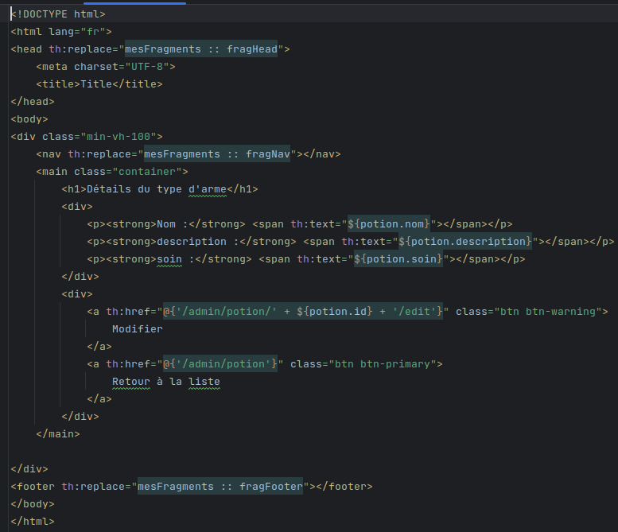
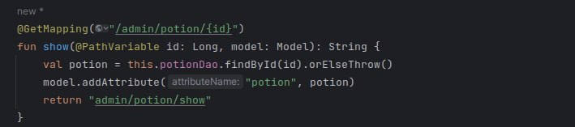
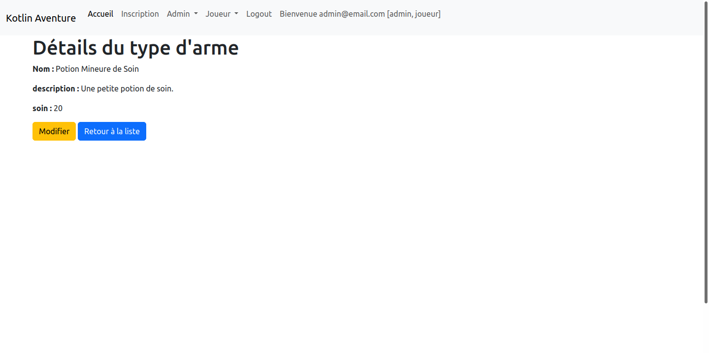
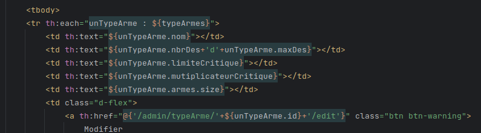
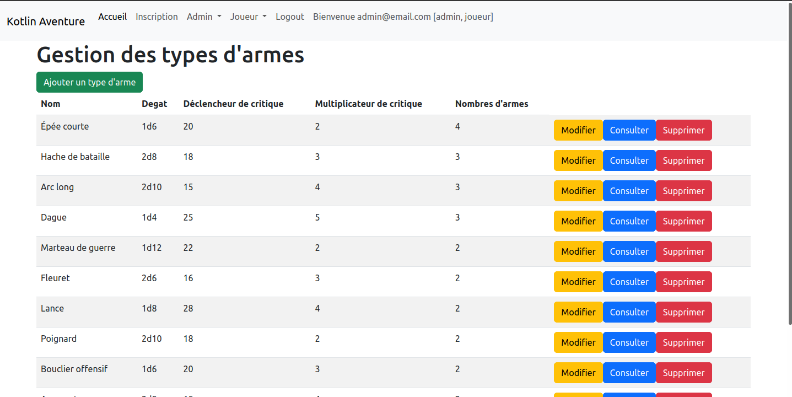
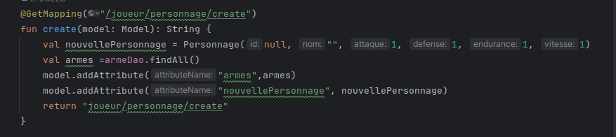
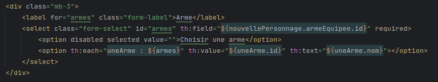
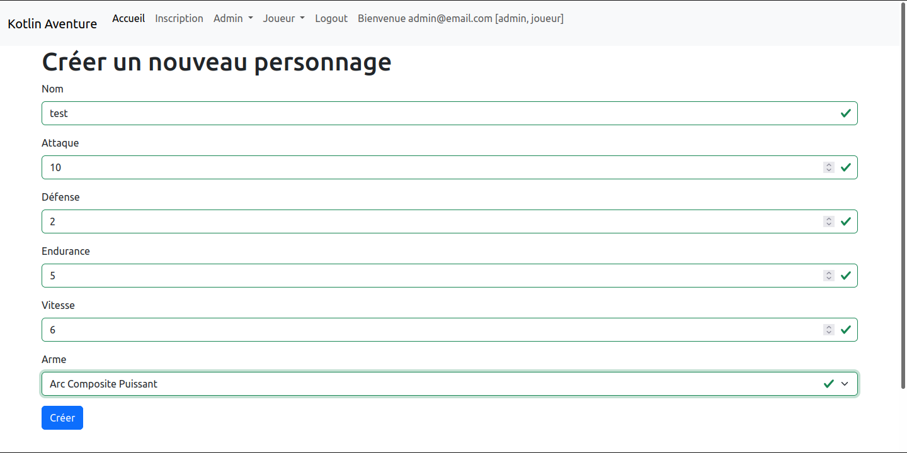

= Épreuve blanche E5
:toc-title: Sommaire
:toc: top

Nom, prénom : TRAN Nicolas +

== Les missions +
*A/* On souhaite que lors de la création d'un personnage (endpoint du formulaire : */joueur/personnage/create)* faire en sorte que le joueur puisse chosir une *arme* par la liste de toutes les armes
 +
 +
*B/* Dans le tableau des *"types d'armes"* faire apparaître dans une colonne sur le tableau le *"nombre d'armes"* qui correspond à ce chaque type.
 +
 +
*C/* Faire en sorte de pouvoir afficher sur une nouvelle page le détail d'une *potion*

== Le plan

Voici l'ordre à laquel j'ai exécuté les mission et mes démarches :

=== *La mission C*

Tout d'abord,il faut créer une fichier *show.hmtl* dans *admin/potion* dans  qui permet d'afficher le le détail d'une potion

Cependant pour pouvoir accéder à cette page il faut ajouter dans le Controleur potion (PotionControleur.kt) un mapping.

Enfin si nous consultons une potion nous devons être redirigé sur la bonne page.

=== *La mission B*

Pour cette mission, il fallait modifier le fichier *index.html* dans *admin/typearme* en faisant en sorte d'ajouter une colonne avec le nombre d'arme ayant ce type.

Ici c'est la ligne *<td th:text="${unTypeArme.armes.size}"></td>* qui permet de faire apparaître le nombre d'armes qui correspond à chaque type.
Si nous nous rendons sur la page */admin/typeArme* cela nous donne ceci

== *La mission A*

Tout d'abord il a fallu modifier le mapping *create* dans le controleur personnage (PersonnageControlleur.kt) pour faire en sorte que le programme récupère toutes les armes disponibles.

Ensuite j'ai ajouter dans le formulaire *create.html* dans *joueur/personnage* une nouvelle case pour sélectionner une arme.

Et enfin si tout fonctionne cela nous donne ceci.

